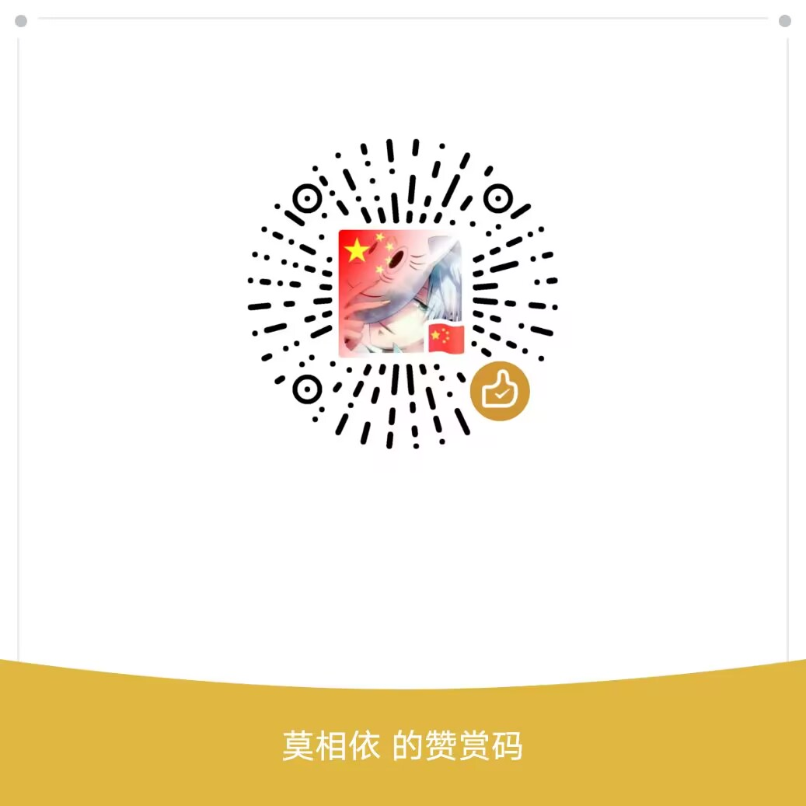

  <h1 align="center"><a href="https://github.com/zhang-bcxb">✨ 编程细胞 GitHub 首页</a></h1>

  

  
  
  
  

 

## 🧸 全栈工程师—编程细胞

热爱前端、热爱技术。 喜欢参与一些开源项目的讨论。
 

### 💞 我的社交统计

 

### 🍭 GitHub 开源项目

 

### 🔥 GitHub 活跃度

 

  
<strong style="color:#e96443;">👀[点击展开] 赞赏支持 </strong>

  
  

